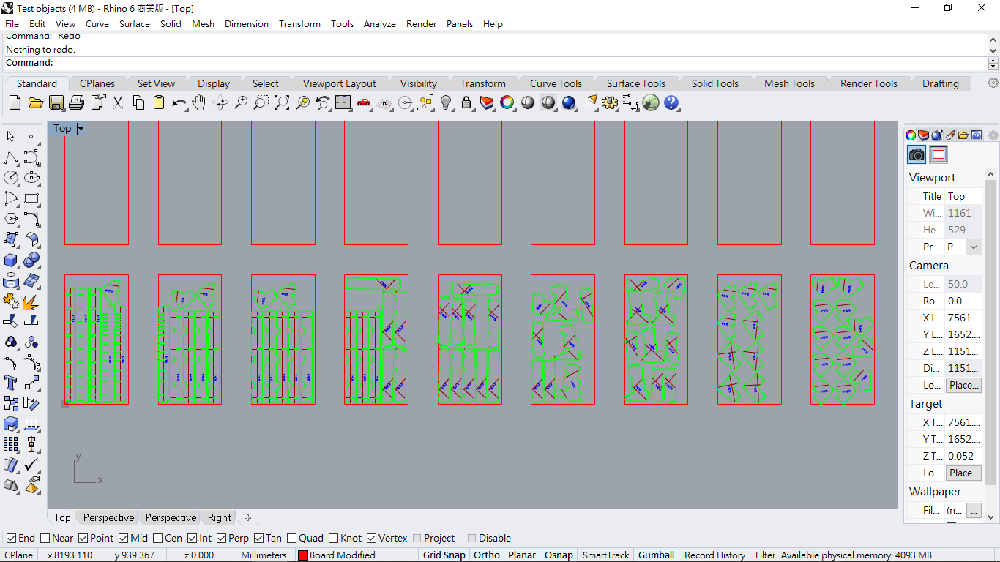

# NestingForRhino6Python
An Nesting algorithm that utilize bottom-left-fill and Enclosure methods. The algorithm nests irregular shape objects into pre-defined number of boards with customized safety distance between objects. <br />
**Note that the file is written in python with ````rhinoscriptsyntax```` that only runs in Rhino6 (Rhino5 would run into unexpected results)**

# Related test results:
Irregular 2D shipbuilding objects for nesting:<br />


